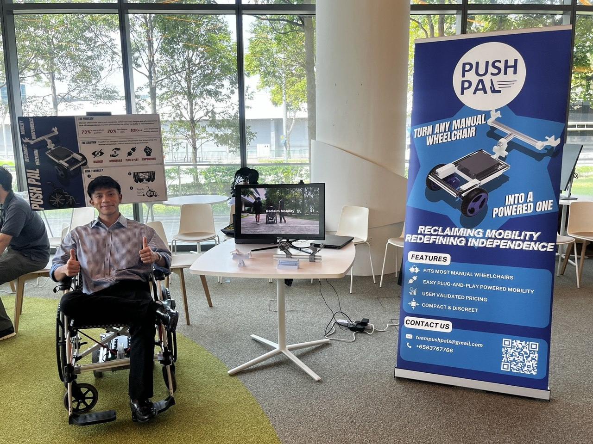
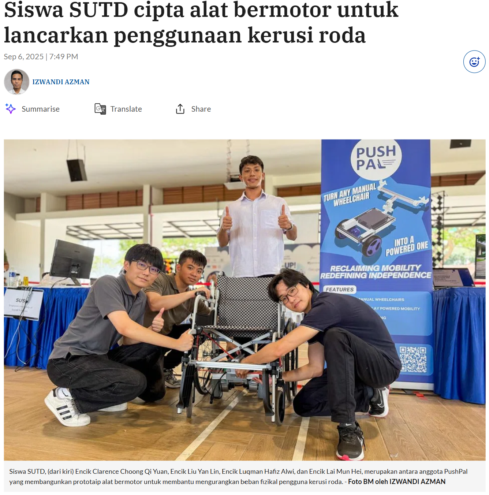

# Project PushPal

Affordable assistive technology solutions designed to improve mobility, independence, and quality of life for wheelchair users.

## Overview

Project PushPal is a social impact initiative focused on developing accessible powered mobility solutions for wheelchair users. Our goal is to create affordable and practical assistive technology that helps users reclaim mobility and redefine independence in everyday life.

As Co-Founder and Team Lead, I coordinated product development, presentations, outreach, and project direction across technical and social impact areas.

---

## Problem Statement

Many powered mobility solutions are expensive and inaccessible to individuals who require affordable alternatives for daily movement and independence.

PushPals aims to bridge this gap by exploring scalable and cost-effective assistive technology solutions that can be adapted across different user needs and environments.

<p align="center">
  <video width="600" controls>
    <source src="videos/pushpalvideo.mp4" type="video/mp4">
  </video>
</p>

## My Role

### Co-Founder & Team Lead

Responsibilities included:

- Leading overall project direction and development
- Coordinating team collaboration and task management
- Presenting the project during showcases and competitions
- Engaging with stakeholders and evaluators
- Overseeing prototype iterations and user-focused improvements
- Managing outreach and public presentations
---
<p align="center">
  
</p>


---

## Achievements

### Funding & Recognition

- Awarded **$6,000 Seed Funding** through the **SUTD BabyShark Fund**
- Awarded **Certificate of Excellence** as Finalists in **Create4Good 2025**, a competition for emerging social enterprises
- Featured in **M3 Project Stem-Up**
- Featured in **Berita Harian**
---
<p align="center">
  
</p>

### Showcases

Presented PushPals at multiple showcases within the Singapore University of Technology and Design (SUTD), where the project was recognised for:

- Practical impact
- Accessibility-focused innovation
- Cross-sector scalability
- Social entrepreneurship potential

---

## Key Focus Areas

- Assistive Technology
- Human-Centered Design
- Social Impact Innovation
- Accessibility Engineering
- Affordable Mobility Solutions

---

## Lessons Learned

Through PushPals, I gained experience in:

- Leading interdisciplinary teams
- Communicating technical ideas to diverse audiences
- Building solutions around real-world accessibility challenges
- Pitching and presenting social impact projects
- Balancing technical feasibility with affordability and scalability

---

## Media & Recognition

- Featured in Berita Harian
- Showcased through M3 Project Stem-Up
- Recognised at Create4Good 2025

---

## Future Directions

Potential future developments include:

- Expanded prototype testing
- Partnerships with healthcare and accessibility organisations
- Improved modularity and adaptability
- Larger-scale deployment and outreach

---

## Repository Contents

```text
README.md
images/
documents/
presentations/
prototype-designs/
```

---

## Team

PushPals was developed through collaborative teamwork focused on creating meaningful and accessible solutions for mobility challenges.
